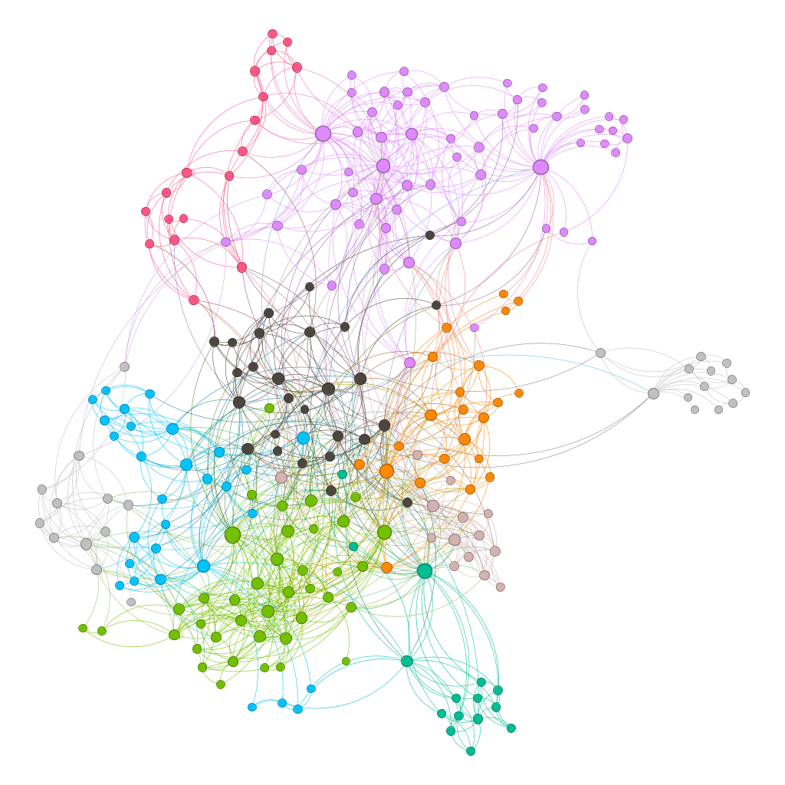
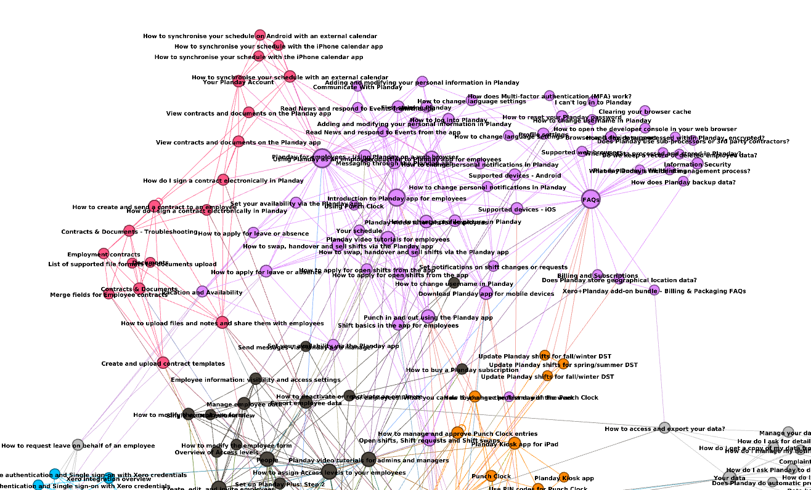

# Documentation Mapper

This repo contains a documentation scraper app and a gexf network builder. It was built for Playday with the intension of using it optimize their user faceing documentation. It uses requests and BeautifulSoup in combination with a interface design to easily extend functionality. From the documentation main page it uses a breath first search to crawl through the next valid links.  

The other part is a tool that uses NetworkX to efficiently convert the harvested data stored in DataFrames to a .gexf file which when loaded into [Gephi](https://gephi.org/) can produce a visuel network to explore and optimize. The colors in the images represent clusters made by a clustering algorithm. it does a excelent job of isolating clusters and it becomes clear how users would traverse through the documentation.   



## Installation
```bash
# get repository.
git clone git@github.com:Benno4president/documentation_mapper.git
# enter folder.
cd documentation_mapper
# create a virtual environment (optional).
python3 -m venv venv
# install the required libs.
pip3 install -r requirements.txt
```

## Usage
```bash
# scraper usage.

# Go into app/scrapers and create a scraper with inherites from IScraper interface. Import and add your scraper to the list in __init__.py to make the scraper controller see it.

python3 app/main.py --help 
| usage: just press play
| 
| Hello there!, welcome to a low code documentation fetcher. 
| Start scraping any source using only very litte and very 
| googlable python code.
| 
| options:
|   -h, --help            show this help message and exit
|   -t, --test            Log level debug
|   -s {all,planday,planday-au}, --scraper {all,planday,planday-au}
|                         Specify a single scraper to run

# to build a .gexf file.
python3 tools/build_doc_link_graph.py [path-to-file]
```
